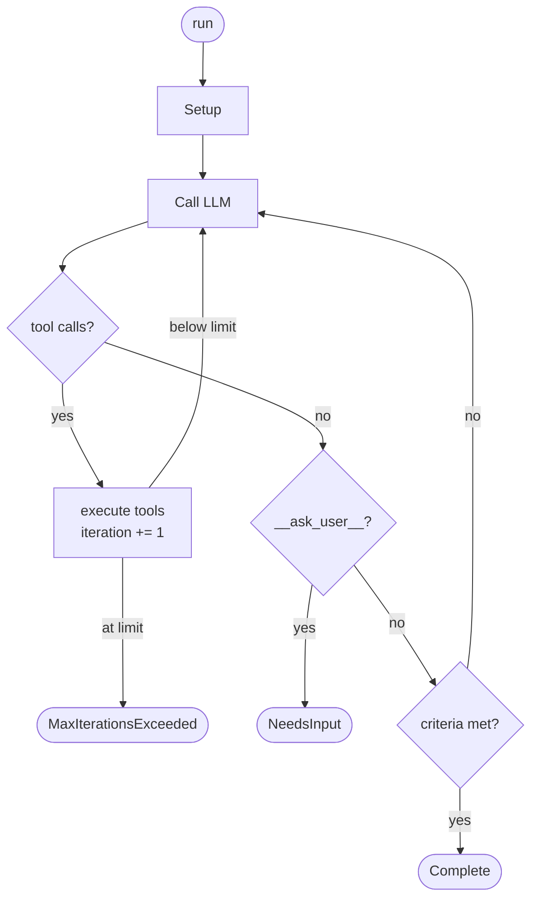

# Agent Runtime Overview

!!! warning "API Stability"
    The agent runtime is a work in progress. APIs are subject to change between minor versions.

The `potato-agent` crate implements an agentic loop in Rust. It calls an LLM, executes tools if the model requests them, and repeats until a completion criterion is met or the iteration limit is reached. The Python bindings expose a simplified interface; this documentation covers the Rust API for cases where you are embedding the runtime in a Rust service or building orchestrations.

## Prerequisites

- An API key in the environment: `OPENAI_API_KEY`, `GEMINI_API_KEY`, or `ANTHROPIC_API_KEY`
- Dependencies in `Cargo.toml`:

```toml
[dependencies]
potato-agent = { version = "0.19" }
potato-type  = { version = "0.19" }
tokio        = { version = "1", features = ["full"] }
serde_json   = "1"
```

---

## Mental Model

An `Agent` is a struct that wraps an LLM provider client together with configuration: a system prompt, a set of tools, a memory store, completion criteria, and lifecycle callbacks.

`agent.run(input, &mut session)` is the single entry point. It builds a prompt from `input`, injects conversation history from memory, attaches tool definitions, and enters a loop. The loop alternates between LLM calls and tool execution until the model produces a text response that satisfies at least one completion criterion.

`SessionState` is a `HashMap<String, Value>` passed by mutable reference to every `run()` call. It carries data between agents in an orchestration and persists key-value state across turns when backed by a `SessionStore`.

---

## Execution Flow

`agent.run(input, &mut session)` executes in two phases: **setup** (runs once) and the **agentic loop** (repeats until done).



Callbacks fire at `before_model_call`, `after_model_call`, `before_tool_call`, and `after_tool_call`. Any callback can abort the loop or override the model response. See [Callbacks](callbacks.md) for details.

---

### Phase 1 — Setup

These steps run once at the start of every `run()` call, before any LLM call:

1. **Build the prompt** from the `input` string.
2. **Load state from stores** — if `SessionStore`, `UserStateStore`, or `AppStateStore` are configured, their snapshots are merged into `session`. Session-level data overwrites user-level, which overwrites app-level on key conflicts.
3. **Hydrate memory** — if `PersistentMemory` is configured, load all stored turns from the database (idempotent; only reads once per agent instance).
4. **Inject conversation history** — flatten stored turns into `[user, assistant, ...]` pairs and insert them after system messages, before the current user turn.
5. **Attach tool definitions** — if the tool registry is non-empty, add all tool schemas to the prompt.

### Phase 2 — The Agentic Loop

The loop runs until a stopping condition is reached. Each iteration:

1. **Check iteration limit** — if `iteration >= max_iterations`, return `Err(MaxIterationsExceeded)`.
2. **`before_model_call`** callback fires. If any callback returns `Abort`, return `Err(CallbackAbort)`.
3. **LLM call** via the configured provider client.
4. **`after_model_call`** callback fires. A callback may return `OverrideResponse(text)` to replace the model's output and stop the loop.

**If the response contains tool calls:**

5. Append the assistant message to the prompt.
6. For each tool call:
    - **`before_tool_call`** callback fires.
    - Execute the tool (async tools are preferred; sync tools are the fallback).
    - **`after_tool_call`** callback fires with the result.
    - Append the tool result to the prompt.
7. Increment `iteration`. Go to step 1.

**If the response is plain text:**

5. If the response starts with `__ask_user__:`, return `NeedsInput { question, resume_context }`.
6. Evaluate all [completion criteria](criteria.md). If none are met, append the assistant message and go to step 1.
7. If any criterion is met:
    - Save the completed turn to memory (write-through for `PersistentMemory`).
    - Persist the session snapshot to `SessionStore` (if configured).
    - Return `Complete(AgentRunResult)`.

### Iteration semantics

The iteration counter increments **only on tool-call iterations**. A model call that returns plain text does not increment the counter. An agent configured with `max_iterations(5)` can execute up to 5 rounds of tool calls before producing a final text response.

If all `max_iterations` are consumed by tool calls and no text response is produced, `run()` returns `Err(AgentError::MaxIterationsExceeded(n))`.

### Memory injection order

History messages are inserted after any system messages and before the current user turn. The order is chronological (oldest first). If you configure both a system prompt and memory, the prompt layout is:

```
[system message]
[history turn 1: user]
[history turn 1: assistant]
[history turn 2: user]
[history turn 2: assistant]
...
[current user input]
```

---

## Quick Start

The minimal agent: a provider, a model, and an input string.

```rust
use potato_agent::{AgentBuilder, AgentRunOutcome, AgentRunner, SessionState};
use potato_type::Provider;

#[tokio::main]
async fn main() -> anyhow::Result<()> {
    let agent = AgentBuilder::new()
        .provider(Provider::OpenAI)
        .model("gpt-4o")
        .system_prompt("You are a concise assistant.")
        .max_iterations(5)
        .build()
        .await?;

    let mut session = SessionState::new();

    match agent.run("What is the capital of France?", &mut session).await? {
        AgentRunOutcome::Complete(result) => {
            println!("{}", result.final_response.response_text());
            println!("tool iterations: {}", result.iterations);
            println!("reason: {}", result.completion_reason);
        }
        AgentRunOutcome::NeedsInput { question, .. } => {
            println!("Agent needs input: {question}");
        }
    }

    Ok(())
}
```

`AgentBuilder::build()` is `async` because Gemini and Vertex clients require async initialization (token refresh, service discovery). OpenAI and Anthropic initialize synchronously but the signature is uniform.

**`model()` is required.** Calling `build()` without a model returns `AgentError::Error("model must be set explicitly")`.

---

## AgentRunOutcome

`agent.run()` returns `Result<AgentRunOutcome, AgentError>`.

| Variant | When |
|---------|------|
| `Complete(Box<AgentRunResult>)` | Loop produced a final text response |
| `NeedsInput { question, resume_context }` | Model emitted `__ask_user__: <question>` |

### AgentRunResult fields

| Field | Type | Description |
|-------|------|-------------|
| `final_response` | `AgentResponse` | Provider response wrapper; call `.response_text()` for text |
| `iterations` | `u32` | Number of tool-call iterations before the final text response |
| `completion_reason` | `String` | Human-readable reason the loop stopped |
| `combined_text` | `Option<String>` | Set by `CollectAll` parallel merge strategy; `None` for single agents |

### Resuming from NeedsInput

When the model emits `__ask_user__: What is your name?` in its response text, the loop pauses and returns `NeedsInput`. The `resume_context` carries a snapshot of the session and iteration state.

```rust
match agent.run("Plan a trip to Paris", &mut session).await? {
    AgentRunOutcome::NeedsInput { question, resume_context } => {
        // Present question to user, collect answer
        let answer = get_user_input(&question);
        // Resume from where the agent paused
        match agent.resume(&answer, resume_context, &mut session).await? {
            AgentRunOutcome::Complete(result) => {
                println!("{}", result.final_response.response_text());
            }
            _ => {}
        }
    }
    AgentRunOutcome::Complete(result) => {
        println!("{}", result.final_response.response_text());
    }
}
```

---

## AgentError variants

| Variant | Cause |
|---------|-------|
| `MaxIterationsExceeded(u32)` | All iterations spent on tool calls; no text produced |
| `CallbackAbort(String)` | A callback returned `CallbackAction::Abort(msg)` |
| `CircularAgentCall(String)` | A sub-agent called itself recursively via session ancestry |
| `DisallowedAgentCall(String)` | Tool policy blocked the sub-agent call |
| `ProviderError(...)` | LLM API returned an error |
| `StoreError(...)` | Persistence layer error |
| `MaxIterationsExceeded(n)` | Increase `max_iterations` or reduce recursive tool call depth |

---

## Component Overview

Each component is covered in detail on its own page. The table below describes what each one does and when you need it.

| Component | What it does | When you need it |
|-----------|-------------|------------------|
| [Tools](tools.md) | Register sync and async Rust functions the model can call | Any agent that should take actions beyond text generation |
| [Memory](memory.md) | Inject prior conversation turns into the prompt | Multi-turn conversations |
| [Callbacks](callbacks.md) | Hook into before/after model calls and tool calls | Logging, tracing, policy enforcement, response interception |
| [Completion Criteria](criteria.md) | Define when the loop stops | Stopping on a keyword, structured output, or custom logic |
| [Session State](session-state.md) | Pass key-value data between agents; persist state across runs | Multi-agent orchestrations, stateful agents |
| [Orchestration](orchestration.md) | Chain agents sequentially or run them in parallel | Complex multi-step workflows |
