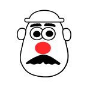

# Potato Head

<div style="margin-bottom: 20px; position: relative; z-index: 1;">
  
</div>


Potato Head is considered a core/utility crate to both [opsml](https://github.com/demml/opsml) and [scouter](https://github.com/demml/scouter), providing essential rust and python components for building agentic workflows. At the current moment, only crates are published, which are then used in both opsml and scouter to provide user-friendly interfaces. The documentation contained in this repository is meant to help you understand the core concepts of potatohead and how to use it within `Opsml` and `Scouter`. 


## Creating a Talking Potato
To get your potato to talk, you first need to create a `Prompt`. It's gotta have something to say, right?

**A Note on all Examples**

All examples in this documentation use an import statement like this:

```python
from potato_head import Prompt
```

In reality, when using `Opsml` or `Scouter`, you will import the `Prompt` class from the respective library, like so:

```python
from opsml.llm import Prompt
from scouter.llm import Prompt
```

### Create a Prompt

```python
from potato_head import Prompt

prompt = Prompt(
  model="gpt-4o", # (1)
  provider="openai", # (2)
  message="Tell me a joke about potatoes.", # (3)
  system_instruction="You are a helpful assistant.",
)
```

1. What model to use. This can be any model supported by the provider.
2. The potato provider to use. `Potato Head` currently supports the `OpenAI` spec and gemini spec, with more to come in the future

### How do we make the potato talk?

```python
from potato_head import Agent, Provider

agent = Agent(Provider.OpenAI) # (1)
response = agent.execute_prompt(prompt=prompt) # (2)


print(response.result)
# Why did the potato win the talent show?
# Because it was outstanding in its field!
```

1. Create an agent with the provider you want to use
2. Execute the prompt with the agent. This will return a response object that contains the response from the model.